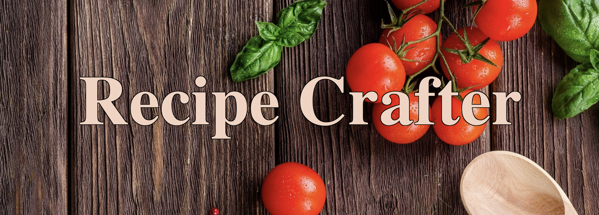
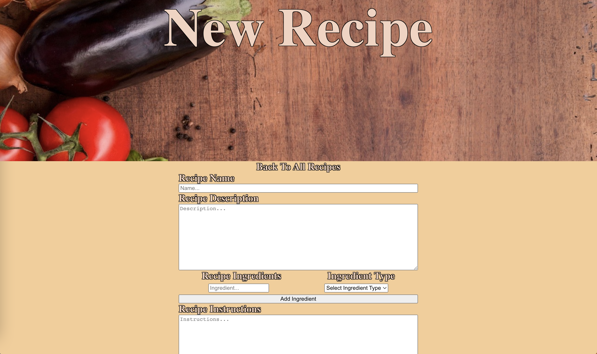

## Date: 19/10/2022

### By: Max Calabro

[Deployed Site] | [GitHub](https://github.com/max-calabro) | [LinkedIn](https://www.linkedin.com/in/max-calabro/)

---

## **_Description_**

#### An application for writing down recipes.

---

## **_Technologies Used_**

<pre>
 Javescript           HTML                    CSS
 React                MongoDB                 GitHub
</pre>

## **_Getting Started_**

[Deployed_Site] |
[Trello](https://trello.com/b/NDdOQKbE/recipe-crafter) |
[ERD](images/Recipe-Crafter-ERD.jpg) |
[Components_Hierarchy_Diagram](images/Recipe-Crafter-Components-Hierarchy-Diagram.jpg)

#### Look though all of the recipes or ceate a new one yourself!

---

## **_Screenshots_**

#### **Home Page**

#### **New Recipe Form**

## 

## **_Updates_**

- [ ] Improved search function
- [ ] About me page linking to other socials
- [ ] Better UI when submitting a form
- [ ] Sorting of the recipes and ingredients

---

### **_Credits_**

#### Me
